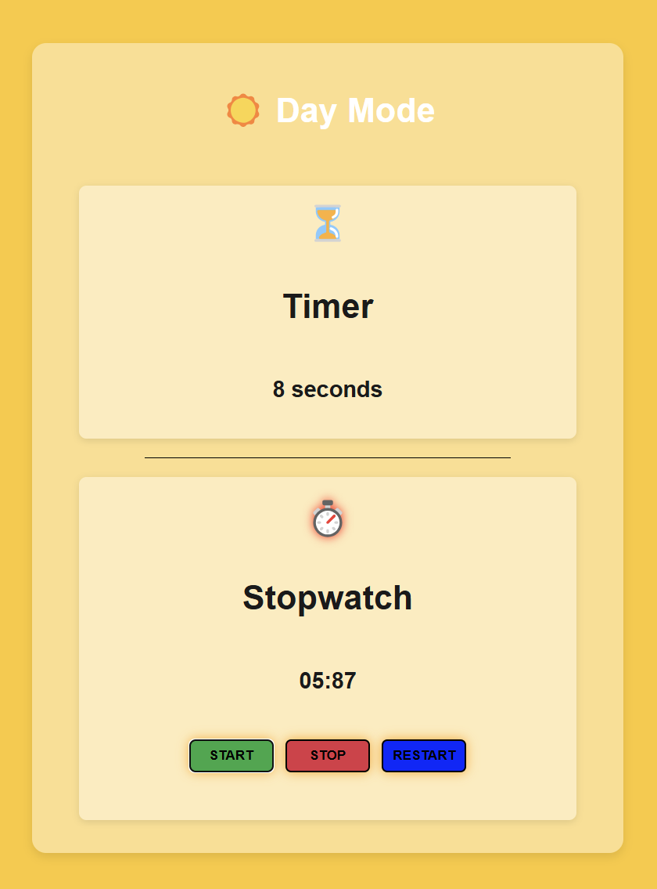
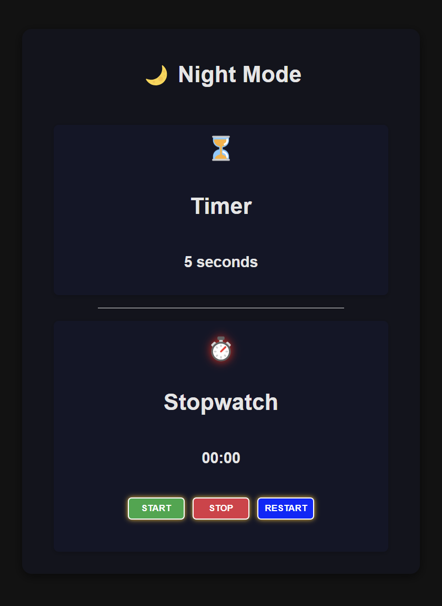

# ⏱️ Chronometer

## 📌 Introduction

The **Chronometer Web App** is an interactive stopwatch and timer with a sleek **Day/Night mode toggle**. It features **smooth transitions**, **dynamic button styling**, and **real-time updates**.

## 🎨 Features

✔️ **Stopwatch** – Start, Stop, and Restart functionality  
✔️ **Timer** – Displays elapsed time in real-time  
✔️ **Day/Night Mode Toggle** – Switch between **light** ☀️ and **dark** 🌙 themes  
✔️ **Animated Effects** – Buttons glow dynamically based on the mode  
✔️ **Smooth Transitions** – Stylish mode changes with elegant animations  
✔️ **Keyboard Support** – Press `Spacebar` to start the stopwatch  

## 📷 Preview

Below are **side-by-side** previews of the app in **Day Mode** and **Night Mode**:

| 🌞 **Day Mode** | 🌙 **Night Mode** |
|----------------|----------------|
|  |  |
